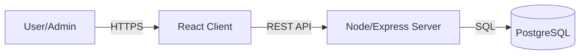

# 🏗️ System Architecture

This document describes the high-level architecture and data flow of the Attendance Tracker.

## 🔷 Overview

The application follows a classic **Client-Server** architecture (3-Tier Architecture):

1.  **Presentation Layer (Client)**: React.js SPA (Single Page Application).
2.  **Application Layer (Server)**: Node.js/Express REST API.
3.  **Data Layer (Database)**: PostgreSQL Relational Database.

---

## 💻 Client Components

- **App.js**: Main router handling navigation and protected routes.
- **Context/State**: Uses React `useState` and `useEffect` for local state management. Authentication state is persisted in `localStorage`.
- **Config**: Centralized API configuration using `axios` interceptors for consistent error handling and base URL management.

### Key Routes
- `/login`: Public login page.
- `/admin`: Dashboard for administrators (protected).
- `/attendance`: Main form for marking attendance.
- `/users`: User management interface.
- `/settings`: Feature toggle configuration.

---

## 🛡️ Server Structure

- **server.js**: Entry point, middleware configuration, and route definitions.
- **Database**: Uses `pg` (node-postgres) for direct SQL queries.
- **Security**: 
  - `helmet`: Sets HTTP security headers.
  - `cors`: Handles Cross-Origin Resource Sharing.
  - `bcrypt`: Hashes passwords before storage.
  - `jsonwebtoken`: Issues and verifies auth tokens.

### Database Schema

key tables include:

1.  **Users**: Authentication credentials (`username`, `password_hash`, `role`).
2.  **Students**: Student records (`system_id`, `name`, `dept`).
3.  **Teams**: Team definitions (`team_id`, `team_name`).
4.  **Attendance**: Daily logs (`student_id`, `date`, `present`, `timestamp`).
5.  **Settings**: Dynamic configuration storage (`key`, `value`).

---

## 🔄 Data Flow

1.  **Authentication**: User sends credentials -> Server verifies hash -> Returns JWT -> Client stores JWT.
2.  **Attendance Marking**: Client sends Student ID -> Server verifies ID -> Creates/Updates `attendance` record -> Returns success.
3.  **Feature Toggles**: Client checks `/api/settings` on load or on admin change -> Enables/Disables UI elements (e.g., Team Toggle) based on response.
